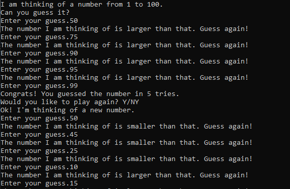

# guess-the-number
A simple guess the number game written in Python. The game prompts you to guess a number from 1 to 100. If your guess is higher or lower, the game lets you know. Once you guess the correct number, the game congratulates you and asks if you want to play again. 

